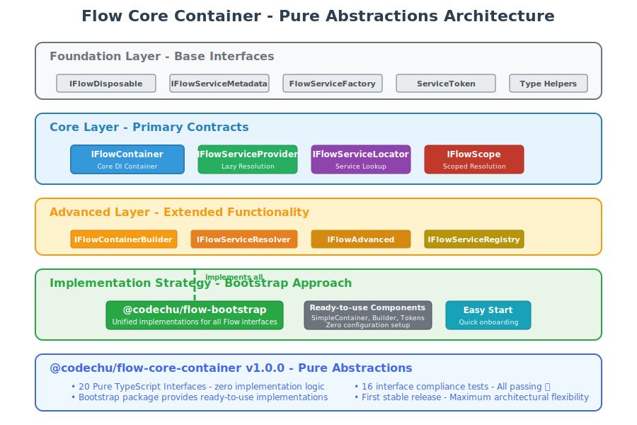

# Flow Core Container - Architecture Documentation

## 🏗️ Architecture Overview



The Flow Core Container is designed as a layered architecture with clear separation of concerns and well-defined boundaries between abstraction levels.

## 📐 Architectural Principles

### 1. Pure Abstractions First
- **Interfaces Only**: Core package provides pure TypeScript interfaces
- **No Implementation Lock-in**: Works with any DI container framework
- **Maximum Flexibility**: Consumers can implement interfaces as needed

### 2. Layered Design
- **Foundation Layer**: Basic building blocks and utilities
- **Core Layer**: Primary DI/IoC contracts
- **Advanced Layer**: Composite and specialized interfaces  
- **Implementation Layer**: Optional production-ready helpers

### 3. Zero Dependencies
- **Pure TypeScript**: No external runtime dependencies
- **Minimal Footprint**: Interface-only design for core abstractions
- **Optional Helpers**: Production utilities without external deps

### 4. Type Safety First
- **Generic Support**: Full TypeScript generics throughout
- **Type Helpers**: Utility types for enhanced developer experience
- **Strict Mode**: Compatible with exactOptionalPropertyTypes

## 🏛️ Layer Architecture

### Foundation Layer
**Purpose**: Provides basic building blocks used throughout the system

**Components**:
- `IFlowDisposable` - Standard resource disposal pattern
- `IFlowAsyncDisposable` - Modern async disposal with Symbol.asyncDispose
- `IFlowServiceMetadata` - Service registration metadata
- `IFlowServiceLifecycle` - Lifecycle hook definitions
- `FlowServiceFactory<T>` - Service factory function type
- `ServiceToken<T>` - Type-safe service identification

**Responsibilities**:
- Define common patterns used across all layers
- Provide type-safe primitives for service identification
- Enable proper resource management and cleanup

### Core Layer
**Purpose**: Defines primary contracts for dependency injection and service management

**Components**:
- `IFlowContainer` - Main DI container interface
- `IFlowServiceProvider<T>` - Lazy service resolution
- `IFlowServiceLocator` - Service locator pattern
- `IFlowServiceRegistry` - Registration management

**Relationships**:
- `IFlowContainer` optionally implements `IFlowDisposable`
- All core interfaces use Foundation Layer primitives
- Independent interfaces that can be implemented separately

**Responsibilities**:
- Service registration and resolution
- Container lifecycle management
- Lazy loading and service location patterns
- Registration metadata management

### Advanced Layer
**Purpose**: Provides composite interfaces that combine multiple core capabilities

**Components**:
- `IFlowAdvancedContainer` - Combines container + registry + resolver
- `IFlowServiceResolver` - Advanced resolution with circular dependency detection

**Relationships**:
- `IFlowAdvancedContainer extends IFlowContainer, IFlowServiceResolver, IFlowServiceRegistry`
- Composites multiple Core Layer interfaces

**Responsibilities**:
- Full-featured container implementations
- Circular dependency detection and resolution
- Advanced resolution patterns (fallback, pattern matching)
- Container hierarchy and event management

### Implementation Layer
**Purpose**: Provides production-ready implementations of core interfaces

**Components**:
- `SimpleContainer` - Complete `IFlowContainer` implementation
- `ContainerBuilder` - Fluent API for container configuration
- `ServiceTokens` - Token creation and management utilities
- Type helpers and utility functions

**Relationships**:
- `SimpleContainer implements IFlowContainer`
- `ContainerBuilder implements IFlowContainerBuilder`
- Uses Core and Foundation layer interfaces

**Responsibilities**:
- Production-ready implementations without external dependencies
- Extensible base classes with protected hook methods
- Type-safe token creation and management
- Fluent configuration APIs

## 🔄 Interface Relationships

### Inheritance Hierarchy
```
IFlowDisposable
├── IFlowContainer (optional)
└── IFlowServiceLifecycle (optional)

IFlowAdvancedContainer
├── extends IFlowContainer
├── extends IFlowServiceResolver  
└── extends IFlowServiceRegistry

IFlowContainerBuilder
└── creates IFlowContainer

IFlowContainerModule
└── configures IFlowContainerBuilder
```

### Composition Patterns
- **Advanced Container**: Composes multiple core interfaces for full functionality
- **Container Builder**: Uses modules and configuration to create containers
- **Service Provider**: Uses tokens for type-safe service identification

### Usage Patterns
- **Injectable Services**: Self-describing services with dependency metadata
- **Service Locator**: Alternative to constructor injection
- **Lazy Resolution**: Deferred service creation until needed

## 🎯 Design Decisions

### 1. Interface Segregation
**Decision**: Separate concerns into focused, single-purpose interfaces
**Rationale**: 
- Follows SOLID principles
- Allows partial implementations
- Reduces coupling between components
- Enables testing of individual concerns

### 2. Optional Extensions
**Decision**: Core interfaces optionally extend utility interfaces
**Rationale**:
- `IFlowContainer` optionally implements `IFlowDisposable`
- Allows implementations to choose cleanup strategies
- Maintains interface focus while enabling resource management

### 3. Generic Type Support
**Decision**: Extensive use of TypeScript generics for type safety
**Rationale**:
- Provides compile-time type checking
- Enables IntelliSense and auto-completion
- Reduces runtime errors through type safety

### 4. Helper Implementation Strategy
**Decision**: Provide optional, extensible implementations
**Rationale**:
- Production-ready code without external dependencies
- Extensible through protected methods and inheritance
- Zero lock-in - pure interfaces remain separate

## 🔧 Extension Points

### 1. Custom Container Implementation
Implement `IFlowContainer` with custom resolution logic:
```typescript
class MyContainer implements IFlowContainer {
  // Custom implementation
}
```

### 2. Extended Helper Classes
Extend provided helpers for specialized behavior:
```typescript
class CustomContainer extends SimpleContainer {
  protected beforeResolve<T>(token: string | symbol): void {
    // Custom logic before resolution
  }
}
```

### 3. Modular Configuration
Create reusable configuration modules:
```typescript
class DatabaseModule implements IFlowContainerModule {
  configure(builder: IFlowContainerBuilder): void {
    builder
      .singleton('Database', async () => new PostgresDB())
      .singleton('Repository', async (c) => new UserRepository(await c.resolve('Database')));
  }
}
```

## 🎨 Integration Patterns

### 1. Framework Integration
The interfaces can wrap existing DI frameworks:
```typescript
class InversifyContainerAdapter implements IFlowContainer {
  constructor(private inversifyContainer: Container) {}
  
  register<T>(token: string | symbol, factory: FlowServiceFactory<T>): void {
    // Adapt to Inversify
  }
}
```

### 2. Multi-Container Scenarios
Advanced containers can manage multiple child containers:
```typescript
class AdvancedContainer implements IFlowAdvancedContainer {
  private children: IFlowContainer[] = [];
  
  createScope(): IFlowContainer {
    const child = new SimpleContainer(this);
    this.children.push(child);
    return child;
  }
}
```

### 3. Middleware Pipeline
Service resolution can be enhanced with middleware:
```typescript
class MiddlewareContainer extends SimpleContainer {
  protected async resolveService<T>(token: string | symbol): Promise<T> {
    // Pre-resolution middleware
    const result = await super.resolveService<T>(token);
    // Post-resolution middleware
    return result;
  }
}
```

## 📊 Quality Attributes

### Maintainability
- **Interface Stability**: Core interfaces rarely change
- **Backward Compatibility**: Semantic versioning ensures safe updates
- **Clear Boundaries**: Layer separation enables independent evolution

### Testability  
- **Interface Contracts**: Easy to mock and test individual concerns
- **Helper Implementations**: Comprehensive test coverage for production code
- **Isolated Testing**: Minimal dependencies enable focused unit tests

### Performance
- **Interface Overhead**: Zero runtime cost for pure interfaces
- **Optional Helpers**: Production implementations optimized for performance
- **Lazy Loading**: Service provider pattern enables on-demand resolution

### Extensibility
- **Open/Closed Principle**: Extend behavior without modifying core interfaces
- **Plugin Architecture**: Module system enables composable functionality
- **Hook Points**: Protected methods in helpers enable customization

This architecture documentation provides a comprehensive understanding of how the Flow Core Container is structured and how its components interact to provide a flexible, type-safe dependency injection foundation.